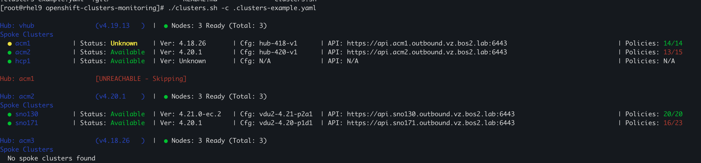
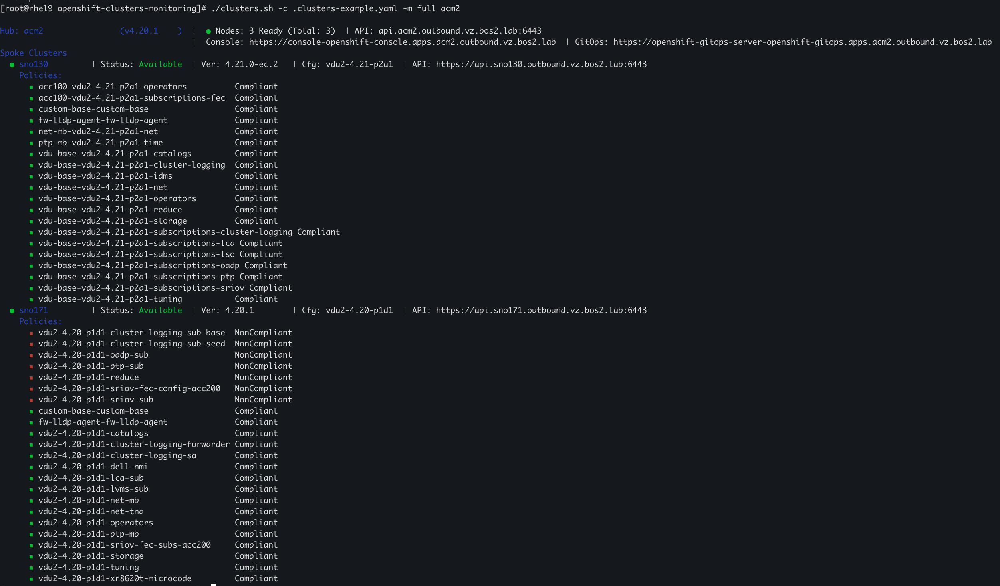

# OpenShift Clusters Monitoring

A bash-based monitoring tool for OpenShift Advanced Cluster Management (ACM) environments that provides a comprehensive view of hub clusters and their managed spoke clusters.

## Overview

This tool creates a visual dashboard that displays:
- **Hub Cluster Information**: Name, version, node status, API URL, Console URL, and GitOps URL
- **Spoke Clusters**: Status, OpenShift version, configuration version, and API endpoints
- **Policy Compliance**: Governance policy compliance status for managed clusters

The script is optimized for performance with minimal API calls and smart caching mechanisms.

## Features

- ✅ Monitor multiple ACM hub clusters from a single configuration
- ✅ Display spoke cluster health and availability status
- ✅ Track policy compliance across managed clusters
- ✅ Two display modes: short (summary) and full (detailed policies)
- ✅ Fast connectivity checks with configurable timeouts
- ✅ Color-coded output for easy status identification
- ✅ Support for both kubeconfig and username/password authentication
- ✅ Filter by specific hub names

## Prerequisites

The following tools must be installed and available in your PATH:

- `oc` - OpenShift CLI
- `yq` - YAML processor (https://github.com/mikefarah/yq)
- `jq` - JSON processor

## Installation

1. Clone the repository:
```bash
git clone <repository-url>
cd openshift-clusters-monitoring
```

2. Make the script executable:
```bash
chmod +x clusters.sh
```

3. Create your configuration file (see Configuration section below)

## Configuration

Create a configuration file named `.clusters.yaml` in the same directory as the script, or specify a custom path using the `-c` option.

### Configuration File Format

```yaml
clusters:
  - name: vhub
    kubeconfig: /path/to/kubeconfig-vhub.yaml
  - name: acm1
    kubeconfig: /path/to/kubeconfig-acm1.yaml
  - name: acm2
    api: https://api.hub2.domain.com:6443
    username: admin
    password: yourpassword
  - name: acm3
    api: https://api.hub3.domain.com:6443
    username: admin
    password: yourpassword
```

### Authentication Methods

The tool supports two authentication methods:

1. **Kubeconfig** (recommended):
   ```yaml
   - name: hub-name
     kubeconfig: /path/to/kubeconfig.yaml
   ```

2. **Username/Password**:
   ```yaml
   - name: hub-name
     api: https://api.cluster.domain.com:6443
     username: admin
     password: yourpassword
   ```

### Example Configuration

See `.clusters-example.yaml` for a sample configuration file.

## Usage

### Basic Usage

```bash
# Monitor all hubs in short mode (default)
./clusters.sh

# Show detailed policy information
./clusters.sh --mode full

# Monitor specific hubs only
./clusters.sh acm1 acm2

# Use custom configuration file
./clusters.sh --config /path/to/config.yaml
```

### Command-Line Options

```
Usage: clusters.sh [OPTIONS] [HUB_NAMES...]

Options:
  -c, --config FILE    Config file path (default: .clusters.yaml)
  -m, --mode MODE      Display mode: full or short (default: short)
                       full:  Show spoke clusters with detailed policies
                       short: Show spoke clusters with policy summary
  -h, --help           Show this help message

Arguments:
  HUB_NAMES            Filter by specific hub names (space-separated)

Environment Variables:
  LAB_TIMEOUT          API timeout in seconds (default: 3)
```

### Display Modes

**Short Mode** (default):
- Displays hub and spoke cluster information with policy compliance summary
- Shows compliance as "compliant/total" (e.g., "5/5")
- Faster execution, minimal output

**Full Mode**:
- Includes all information from short mode
- Lists individual policies and their compliance status for each spoke cluster
- More detailed but slower execution

### Examples

```bash
# Monitor all hubs with default timeout
./clusters.sh

# Use longer timeout for slow networks
LAB_TIMEOUT=10 ./clusters.sh

# Show only acm1 hub with detailed policies
./clusters.sh -m full acm1

# Use custom config and monitor specific hubs
./clusters.sh -c custom-config.yaml hub1 hub2

# Monitor all hubs with full policy details
./clusters.sh --mode full
```

## Output Format

### Example Output

Here's a real example of the monitoring output in short mode:



Spoke Cluster Information (Full Mode):



### Status Colors

- 🟢 **Green**: Available/Ready/Compliant
- 🔴 **Red**: Not Available/Not Ready/NonCompliant/Unreachable
- 🟡 **Yellow**: Unknown status

## Performance Optimization

The script includes several optimizations for fast execution:

1. **Batch API Calls**: Fetches all managed clusters in a single API call
2. **Policy Caching**: Loads all policies once per hub and caches results
3. **Fast Connectivity Checks**: Quick validation before processing each hub
4. **Efficient JSON Processing**: Uses `jq` for fast JSON parsing
5. **Configurable Timeouts**: Prevents hanging on unreachable clusters

## Troubleshooting

### Hub Shows as UNREACHABLE

- Check network connectivity to the hub cluster API
- Verify kubeconfig or credentials are correct
- Increase timeout: `LAB_TIMEOUT=10 ./clusters.sh`

### "Command not found" Errors

Install missing dependencies:
```bash
# For Fedora/RHEL/CentOS
dnf install jq
pip3 install yq

# For Ubuntu/Debian
apt install jq
pip3 install yq

# Install OpenShift CLI
# Download from https://mirror.openshift.com/pub/openshift-v4/clients/ocp/
```

### Permission Denied

Make sure the script is executable:
```bash
chmod +x clusters.sh
```

### Config File Not Found

Either:
- Create `.clusters.yaml` in the script directory
- Use `-c` option to specify config file path: `./clusters.sh -c /path/to/config.yaml`

## Environment Variables

- `LAB_TIMEOUT`: API request timeout in seconds (default: 3)
  ```bash
  export LAB_TIMEOUT=10
  ./clusters.sh
  ```

## Contributing

Contributions are welcome! Please feel free to submit issues or pull requests.

## License

[Specify your license here]

## Author

[Specify author information here]

## Notes

- The script automatically skips the `local-cluster` (hub cluster itself) when listing spoke clusters
- Infrastructure names are cleaned to remove random suffixes (e.g., `acm1-d7bnf` → `acm1`)
- TLS verification is skipped for API connections (suitable for lab environments)
- The script uses `set -euo pipefail` for strict error handling

## Advanced Configuration

### Custom Board Width

Edit the script to modify display widths:
```bash
BOARD_WIDTH=120  # Overall board width
BOX_WIDTH=90     # Content box width
```

### API Timeout Configuration

Set timeout via environment variable:
```bash
# For a single run
LAB_TIMEOUT=5 ./clusters.sh

# Persistent setting
export LAB_TIMEOUT=5
./clusters.sh
```

## Future Enhancements

Potential improvements for future versions:

- [ ] JSON/YAML output format for automation
- [ ] Prometheus metrics export
- [ ] Webhook notifications for status changes
- [ ] Watch mode for continuous monitoring
- [ ] Export to HTML/PDF reports
- [ ] Historical data tracking

