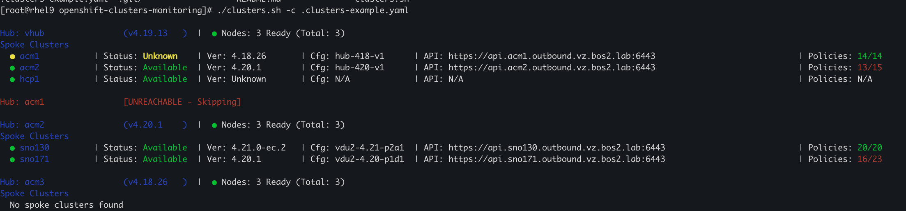
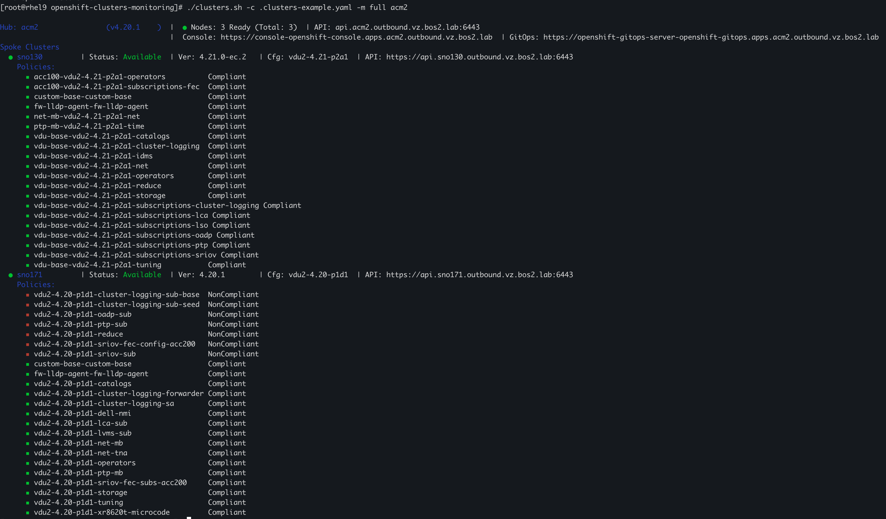

# hubwatch

A bash-based monitoring tool for OpenShift Advanced Cluster Management (ACM) environments that provides a color-coded terminal dashboard showing hub clusters and their managed spoke clusters.

## Features

- Monitor multiple ACM hub clusters from a single configuration
- Display spoke cluster health, OpenShift version, and API endpoints
- Track governance policy compliance across managed clusters
- Two display modes: short (summary) and full (per-policy details)
- Support for both kubeconfig and username/password authentication
- Color-coded output for quick status identification
- Fast execution with batch API calls and policy caching

## Prerequisites

- [`oc`](https://mirror.openshift.com/pub/openshift-v4/clients/ocp/) - OpenShift CLI
- [`yq`](https://github.com/mikefarah/yq) - YAML processor (Go version by mikefarah, **not** the pip `yq`)
- [`jq`](https://jqlang.github.io/jq/) - JSON processor

## Installation

```bash
git clone https://github.com/bzhai/hubwatch.git
cd hubwatch
chmod +x clusters.sh
```

## Configuration

Create a `.clusters.yaml` file in the same directory as the script (see `.clusters-example.yaml`), or specify a custom path with `-c`.

```yaml
clusters:
  # Kubeconfig auth (recommended)
  - name: acm1
    kubeconfig: /path/to/kubeconfig-acm1.yaml

  # Username/password auth
  - name: acm2
    api: https://api.hub2.domain.com:6443
    username: admin
    password: yourpassword
```

## Usage

```bash
# Monitor all hubs in short mode (default)
./clusters.sh

# Show detailed per-policy compliance
./clusters.sh --mode full

# Monitor specific hubs only
./clusters.sh acm1 acm2

# Use custom config file
./clusters.sh -c /path/to/config.yaml

# Increase API timeout for slow networks (default: 3s)
LAB_TIMEOUT=10 ./clusters.sh
```

### Options

```
Usage: clusters.sh [OPTIONS] [HUB_NAMES...]

Options:
  -c, --config FILE    Config file path (default: .clusters.yaml)
  -m, --mode MODE      Display mode: full or short (default: short)
  -h, --help           Show this help message

Arguments:
  HUB_NAMES            Filter by specific hub names (space-separated)

Environment Variables:
  LAB_TIMEOUT          API timeout in seconds (default: 3)
```

## Output

**Short mode** (default) — one line per spoke with compliance ratio (e.g., "5/5"):



**Full mode** — adds per-policy listing under each spoke:



### Status Colors

- **Green**: Available / Ready / Compliant
- **Red**: Not Available / Not Ready / NonCompliant / Unreachable
- **Yellow**: Unknown status

## Troubleshooting

| Problem | Solution |
|---------|----------|
| Hub shows UNREACHABLE | Check network/credentials; try `LAB_TIMEOUT=10 ./clusters.sh` |
| `yq` errors or wrong output | Ensure you have [mikefarah/yq](https://github.com/mikefarah/yq), not the pip version |
| Command not found | Install `oc`, `yq`, and `jq` (see Prerequisites) |
| Config file not found | Create `.clusters.yaml` or use `-c /path/to/config.yaml` |

## Notes

- The `local-cluster` (hub itself) is automatically excluded from spoke listings
- Infrastructure names have random suffixes stripped (e.g., `acm1-d7bnf` -> `acm1`)
- TLS verification is skipped (designed for lab environments)
